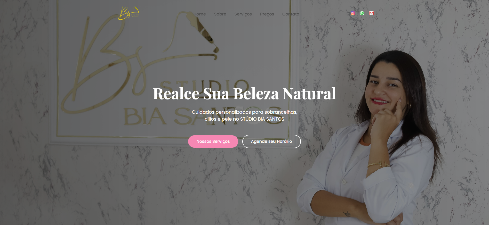

# BS STUDIO - Bianca Santos Estética

Este é o site oficial do **Studio de Estética Bianca Santos**, localizado no Rio de Janeiro/RJ. O objetivo é apresentar os serviços oferecidos pelo estúdio de forma clara, profissional e acessível, além de facilitar o contato com potenciais clientes.

## 📸 Demonstração




## 🔗 Acesse

[](https://www.instagram.com/bias.studioo/)

[](https://wa.me/5521973507126)

[](mailto:contato@biastudio.com.br)


## ✨ Funcionalidades
- Apresentação dos serviços de estética facial e corporal.
- Seção de tabela de preços com listagem dinâmica.
- Botões para agendamento rápido via WhatsApp.
- Menu de navegação responsivo (desktop e mobile).
- Integração com Google Maps para localização.
- Animações suaves de entrada dos elementos na página.

## 🛠 Tecnologias Utilizadas

- **HTML5** — Estruturação da página.
- **CSS3** — Estilização moderna e responsiva.
- **JavaScript** — Funcionalidades dinâmicas (exibição de serviços, abrir/fechar menu mobile, etc).
- **Google Fonts** — Tipografias "Playfair Display" e "Poppins".
- **SVGs Otimizados** — Ícones leves e escaláveis.
- **Google Maps Embed** — Mapa interativo do local.

## 📂 Estrutura do Projeto

```plaintext
/
├── index.html
├── style.css
├── script.js
├── /src
│   ├── /img
│   │   ├── logobiasstudio.png
│   │   ├── insta color.svg
│   │   ├── whats color.svg
│   │   ├── email-color.svg
│   │   ├── menu.svg
│   │   ├── menu-close.svg
│   │   └── outras imagens...
´´´
```
## 📱 Responsividade
O site é totalmente responsivo, garantindo uma ótima experiência de navegação tanto em dispositivos móveis quanto em desktops.

